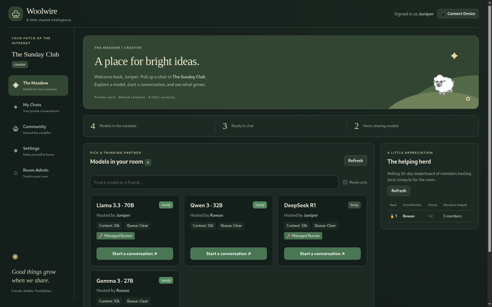

# Woolwire

[](https://github.com/Chrisbaack/woolwire/actions/workflows/ci.yml)
[](LICENSE)

**A private room for shared intelligence.**

Woolwire lets a small group of friends share language models running on their
own hardware. Create a room, invite your friends, and start a private chat with
a model someone is hosting. You can participate without hosting a model yourself.

The app runs on your computer or server and opens in your browser. Each person
has their own installation, conversations, and settings. Members connect over
an encrypted peer transport; the room creator handles admissions, not everyone's
inference traffic.



*Preview with synthetic room, host, and model data.*

## What you can do

- **Find a thinking partner.** Browse the Meadow, search models and hosts, and
  filter for models ready to chat.
- **Keep your own conversations.** Stream replies in My Chats, choose a host,
  cancel requests, and use no-save mode for transcripts kept in memory.
- **Share the models you already run.** Connect an external server exposing the
  OpenAI text chat-completions interface, or use the managed llama.cpp runner.
- **Bring your GGUF collection.** Discover models in a local directory or Hugging
  Face cache, or download weights through Settings.
- **Spend time with your room.** Use shared community channels and acknowledge
  the friends contributing compute.
- **Use your own clients.** Access the room's model catalog and text completions
  through the token-authenticated `/v1` API.

[Feature guide](docs/FEATURES.md) · [Getting started](docs/GETTING_STARTED.md) ·
[API reference](docs/API.md) · [All documentation](docs/README.md)

## Quick start

One line, with Docker:

```sh
docker run -d --name woolwire-app --restart unless-stopped -p 127.0.0.1:7070:7070 -v woolwire_state:/state ghcr.io/chrisbaack/woolwire:0.1 && docker logs -f woolwire-app
```

That pulls the published image, starts the app in the background, and follows
its logs. Podman works the same with `podman` in place of `docker`. You do not
need Git, Go, Node.js, or a GPU; you do need Docker or Podman on a 64-bit
x86 or ARM machine (Apple Silicon included), and outbound access for Tailcat
connectivity.

1. Copy the **one-time setup secret** from the logs, then press Ctrl+C to stop
   following them; the app keeps running. Keep those logs private; the secret
   gives owner access until redeemed.
2. Open **http://127.0.0.1:7070** and enter the secret.
3. Choose a display name, then **Host a room** or **Join a room**.
4. Select a model in **The Meadow**, or add one in **Settings**.

A new room has no models until a member publishes one. Joining requires the
creator to be online. To pair another browser with *your installation*, use
**Connect Device**; give friends the *room invitation* so they can join from
their own installations.

Stop with `docker stop woolwire-app` and start again with
`docker start woolwire-app`. Your identity, rooms, and chats live in the
`woolwire_state` volume, which survives removing the container;
`docker volume rm woolwire_state` deletes them.

`0.1` follows the latest 0.1.x release, and `latest` the newest release of
any version. Compose profiles, model hosting, and upgrades are covered in
[Getting started](docs/GETTING_STARTED.md).

## Choose how to run

| Setup | Best fit | Guide |
|---|---|---|
| Docker or Podman Compose, base | Request models from friends or connect an existing model server | [Base installation](docs/GETTING_STARTED.md#base-compose) |
| Managed Compose, NVIDIA | Run GGUF weights in a companion container | [Managed installation](docs/GETTING_STARTED.md#managed-compose) |
| Single container | The quick start above, or your own container setup | [Container commands](docs/GETTING_STARTED.md#single-container) |
| Native Go binary | Run without a container engine | [Build and run](docs/GETTING_STARTED.md#native-binary) |
| Native app plus runner | Use a locally installed `llama-server`, including CPU inference | [Native runner](docs/GETTING_STARTED.md#native-runner) |
| Development checkout | Change the Go backend or React UI | [Contributing](CONTRIBUTING.md) |

Linux is the primary development environment. The managed image is CUDA-based;
Apple Metal and AMD GPU support are not supplied as managed container profiles.
See the guide for CPU and Podman GPU adjustments.

## Privacy and trust

Private chats are stored by the requester's installation and sent to the
selected model host for inference. They are not broadcast to the room or made
available to the creator by virtue of that role. No-save mode prevents Woolwire
from persisting transcript bodies; the selected host and any external inference
backend still process the content and may have their own retention policies.

Community messages and contribution receipts are shared room data. Peers
authenticate device identities and verify signed membership records. The creator
must be online for new admissions; admitted members can continue communicating
without the creator when they can reach one another.

The UI port is published to loopback by default. Pairing a browser grants owner
access to that installation, including its saved chats and configuration.
[Security and limitations](SECURITY.md) · [Backup and restore](docs/BACKUP_RESTORE.md)

## Status

Woolwire is an early project for evaluation with people you trust. Core room,
chat, external hosting, managed hosting, community, and contribution flows are
implemented. It has not completed a private pilot or external security review.

Package tests cover many boundaries using an in-memory transport and a fake
engine. A real Tailcat feasibility probe and a single-node Podman check are
recorded, but the full multi-process acceptance suite and end-to-end managed
inference against a real `llama-server` remain outstanding.
[Validation status](docs/STATUS.md) distinguishes implementation from verified
release readiness.

## Development

The source currently requires **Go 1.27.1** as declared in `go.mod`. Use
**Node.js 22.6+** for frontend development and tests.

```sh
npm --prefix web ci
npm --prefix web run build
npm --prefix web test
go vet ./...
go test -race ./...
CGO_ENABLED=0 go build -trimpath -o bin/woolwire ./cmd/woolwire
```

`scripts/build.sh` wraps the build half of that: it rebuilds the UI bundle and
both binaries, and with no arguments also rebuilds the container images and
restarts the local Compose stack. `scripts/build.sh --help` lists the targets.

The Go binary embeds `web/dist`, so rebuild the frontend before rebuilding the
binary after UI changes. See [CONTRIBUTING.md](CONTRIBUTING.md) for repository
structure, development workflows, and documentation checks.

## License

Woolwire is released under the [MIT License](LICENSE).

Dependency and model licenses are separate from the project's license. Every
Go module and npm package linked into a build is under a permissive license
(MIT, BSD, ISC, or Apache-2.0); the [dependency inventory](docs/SBOM.md) links
to the manifests and records the check. The weights you choose to run carry
their own terms, which Woolwire does not evaluate for you.
