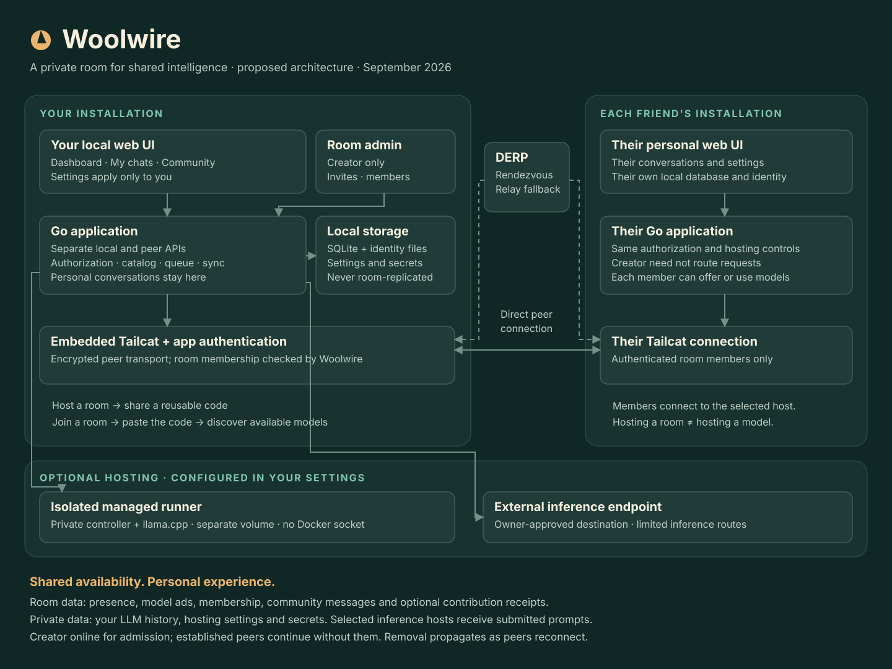

# Woolwire

**A private room for shared intelligence.**

Woolwire is a working name for a peer-to-peer platform where friends share their locally hosted language models. Wool nods to the llama mascot; wire hints at the seamless connections between members. The name is provisional and has not been checked for trademark or domain availability.

## The experience

1. Launch the container app with Podman or Docker and open its local web UI.
2. Choose **Host a room** or **Join a room**.
3. Hosting produces a reusable join code. Joining means pasting that code.
4. See connected friends and currently available models on your dashboard.
5. Select a model and start your own conversation.
6. Configure your models, endpoints, limits, and schedule in **Settings**.

Every person runs their own app. Hosting a room means creating it; hosting a model means offering compute. Either role can exist without the other.

Your conversations and settings belong to your installation. The creator has a separate room administration panel, not access to everyone else's settings or LLM conversations. Community messages are intentionally shared with the room.

## Planning documents

- [Architecture and security boundaries](docs/ARCHITECTURE.md)
- [Architecture diagram — standalone SVG](docs/architecture.svg)
- [Architecture diagram — editable Mermaid](docs/architecture.mmd)
- [Implementation plan and acceptance gates](docs/IMPLEMENTATION_PLAN.md)
- [M0 feasibility evidence](docs/M0_FEASIBILITY.md)
- [M0 networking and relay operations](docs/M0_NETWORKING.md)



## Status

Woolwire has not been through a pilot. `go vet ./...` and `go test -race ./...`
are green, and every milestone below is implemented, but the acceptance gates
are only partly evidenced: the package tests run over an in-memory transport,
and the multi-process gate over real Tailcat
([test/integration](test/integration)) has not been run against a live relay
here.

- **M0 (Transport Feasibility):** Implemented, gate passed. Pinned Tailcat `v0.6.0`, mutual TLS 1.3, Ed25519 room-authority certificate pinning, live proof of creator-offline continuation, address regeneration, and substituted peer rejection. The M0 probe lives under [hack/](hack/); it is feasibility evidence, not part of the shipped product. See [docs/M0_FEASIBILITY.md](docs/M0_FEASIBILITY.md).
- **M1 (Local App & Room Onboarding):** Implemented, gate not yet passed against a live relay. Pure-Go SQLite migrations (`modernc.org/sqlite`), Ed25519 identity, loopback-only local API (`127.0.0.1:7070`), a mutually authenticated peer listener and a separate authority-signed bootstrap listener, embedded React 18 / TypeScript SPA, roster synchronization with a 30 second removal poller, and a creator room administration panel. **Outstanding:** the join, removal-propagation, and restart gate has only been exercised over the in-memory transport.
- **M2 (Live Dashboard & External Inference):** Implemented, gate not yet passed against a live relay. Signed model advertisements with opaque IDs and 90s freshness expiry, the SSRF policy described below, a round-robin per-member fair queue with execution deadlines shared by local and peer requests, "My Chats" with live SSE streaming, cancellation scoped to the submitter, no-save privacy mode that keeps its transcript in memory, and token-authenticated OpenAI compatibility. **Outstanding:** three real nodes discovering and serving each other across processes.
- **M3 (Managed Models & Resource Controls):** Implemented, gate partly passed. Companion runner protocol (`/runner/v1`), hardware detection, a background GGUF download manager with streaming SHA-256 verification and disk budgets, and non-privileged Compose profiles. The runner's lifecycle is covered against a fake engine in `internal/runner`. **Outstanding:** an end-to-end run against a real `llama-server` and a peer requesting a managed model.
- **M4 (Personal Community Experience):** Implemented, gate not yet passed against a live relay. Signed immutable events, per-author sequence cursors for sync, deterministic quarantine of sequence conflicts, replicated channels, author edits and deletions, creator moderation tombstones, remote-image neutralization, and a 30 day / 250 MiB retention job. **Outstanding:** partition and rejoin between real processes.
- **M5 (Contributions & Social Recognition):** Implemented, gate not yet passed against a live relay. Jointly-signed completion receipts, no prompt or content leakage, a 20 point per member-pair per UTC day cap, self-service exclusion, a 30-day rolling leaderboard, and participant opt-out. **Outstanding:** convergence across three real nodes.
- **M6 (Release Hardening & Verification):** Implemented, gate partly passed. Local metrics endpoint (`GET /api/v1/metrics`), encrypted backup export (`POST /api/v1/backup/export`), reproducible pure-Go build instructions, [SBOM](docs/SBOM.md), [backup and recovery guide](docs/BACKUP_RESTORE.md), and a test suite that passes under the race detector. **Outstanding:** the Compose profiles have not been brought up end to end, and no external security review has been done.

## Building and running

Run all commands directly from the project root:

```sh
# Run full automated test suite with race detector
go test -v -race ./...
go vet ./...

# Build frontend static assets (embedded into Go binary)
npm --prefix web run build

# Build standalone binaries (reproducible pure-Go, no CGO)
CGO_ENABLED=0 go build -trimpath -o bin/woolwire ./cmd/woolwire
CGO_ENABLED=0 go build -trimpath -o bin/woolwire-runner ./cmd/woolwire-runner

# Run standalone Woolwire instance
./bin/woolwire -listen 127.0.0.1:7070 -state ./state
```

On first start the node prints a one-time setup secret. It is shown once, on
that boot only, and stops working as soon as it is exchanged for a session.
Mint another from Settings on a device that is already signed in.

The multi-process integration tests are behind a build tag because they need
outbound network access to reach DERP relays:

```sh
go test -tags integration -timeout 20m ./test/integration/
```

## Deployment Profiles

### Base Deployment (External Endpoints & Inference Requester)
Runs the lightweight single container app, with zero model weights or GPU requirements:
```sh
podman compose -f deploy/base/compose.yaml up -d
# or docker compose -f deploy/base/compose.yaml up -d
```

### Managed Deployment (Local GGUF Weights & Hardware Acceleration)
Runs the app paired with the isolated companion runner:
The runner token is not hardcoded. Generate one before the first `up`:

```sh
printf 'WOOLWIRE_RUNNER_TOKEN=%s\n' "$(openssl rand -hex 32)" >> deploy/managed/.env
podman compose -f deploy/managed/compose.yaml up -d
# or docker compose -f deploy/managed/compose.yaml up -d
```

Key Deployment Properties:
- **No Docker Socket:** Neither container mounts `/var/run/docker.sock`.
- **Non-Root User:** Runs as non-root UID:GID `1000:1000`, with all capabilities dropped and a read-only root filesystem.
- **Read-Only Model Mount:** Runner mounts model weights as read-only (`:ro`).
- **Runner Has No Egress:** The runner sits only on an internal network and refuses to start without a token. The app sits on both that network and an egress network, because Tailcat must reach DERP relays and Docker publishes no host ports for an internal-only container.
- **Ceilings Enforced:** Container resource limits prevent host resource exhaustion.

## Trust Model & Privacy Guarantees

1. **Private LLM Conversations:** Conversations and prompt history belong exclusively to the requester's device. Prompts are never stored on the host's disk or sent to the room creator. In no-save mode the transcript never leaves memory on any node.
2. **Every Peer Connection Is Authenticated:** The peer API runs over mutual TLS 1.3. A connection is accepted only if the certificate's Ed25519 key belongs to an admitted member whose membership record verifies against the pinned room authority, so reaching a node's transport address is not enough to talk to it. Member identity comes from the TLS session, never from a request body.
3. **Only the Creator Admits:** `/bootstrap/v1/join` is served solely by the creator, under a certificate the joiner pins from the authority key in the invitation. Members never hold the invitation code. The joining device's key is taken from its certificate, so a joiner cannot claim another device's identity.
4. **Creator is Not a Relay:** The room creator is an admission and admin authority. Once admitted, peers communicate directly over encrypted transport; inference continues uninterrupted if the creator goes offline.
5. **Removals Propagate:** Every node polls its peers for signed roster updates on a 30 second jittered interval and before dispatching inference. Applying a removal cancels that member's queued and running work, drops their address, and makes their next handshake fail.
6. **No Arbitrary Proxying (SSRF Protection):** External model endpoints are resolved by a guarded dialer that checks every address the name resolves to and then connects to the address it checked, so a name that resolves differently afterwards gains nothing. Cloud metadata addresses are refused unconditionally; link-local, multicast, private, and carrier-grade NAT ranges are refused unless the owner opted that one endpoint in. Redirects are rejected, plain HTTP is loopback-only, and destination ports are pinned off-machine.
7. **One-Time Setup Secret:** The local API's pairing secret is 128 bits, printed once, invalidated on first exchange, and rate limited per client address. It is never returned by the API and never placed in a URL. The OpenAI-compatible routes require their own bearer token at all times.
8. **Encrypted Backups:** Exports are sealed with an Argon2id-derived key from a passphrase the owner supplies, and are written under the state directory. The database file itself is `0600`.
9. **Retention:** Community events are purged after 30 days or 250 MiB, whichever binds first, and inbound events dated more than five minutes in the future are refused so nothing can outlive the window.
10. **Social Recognition:** Contribution points provide informal community acknowledgement and never confer financial value or access control.

## Documentation Index

- [Architecture & Security Boundaries](docs/ARCHITECTURE.md)
- [Implementation Plan & Acceptance Gates](docs/IMPLEMENTATION_PLAN.md)
- [Software Bill of Materials (SBOM)](docs/SBOM.md)
- [Backup and Disaster Recovery Guide](docs/BACKUP_RESTORE.md)
- [M0 Feasibility Evidence](docs/M0_FEASIBILITY.md)
- [M0 Networking & Relay Operations](docs/M0_NETWORKING.md)
- [Outstanding review tasks](docs/REVIEW_TASKS.md)

