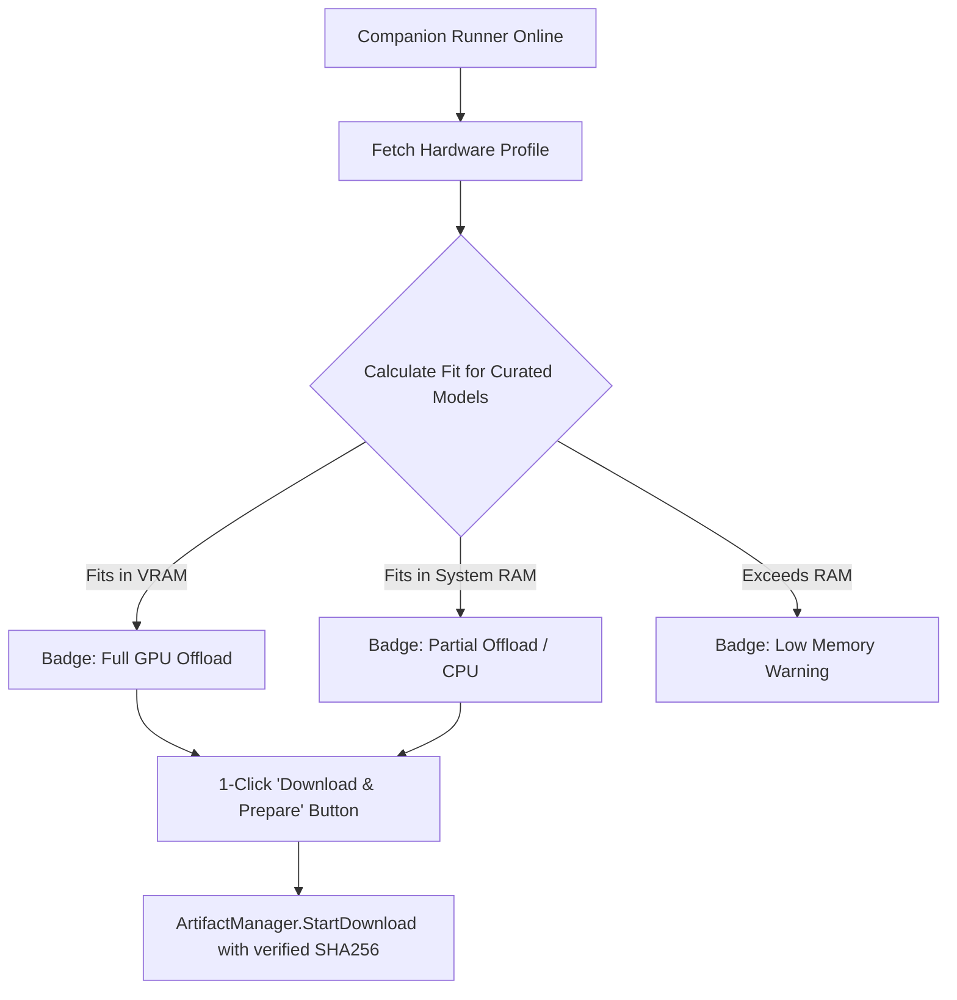

# Woolwire Quality of Life (QoL) Roadmap & Harness Comparison

> Historical proposal, not the current feature inventory. Some items have since
> shipped and others remain ideas. See [Features](FEATURES.md) and
> [Validation status](STATUS.md) for current behavior and evidence.

This document details recommended Quality of Life (QoL) features for **Woolwire**, drawing architectural and UX insights from local model harnesses such as **LM Studio**, **Unsloth Studio**, **Open WebUI**, and **Jan.ai**. It maps these enhancements directly to Woolwire's P2P room mesh architecture and companion runner.

---

## 1. Executive Summary & Comparative Matrix

While traditional harnesses (LM Studio, Unsloth Studio, Ollama) focus on single-machine workflows, Woolwire is uniquely positioned as a **private peer-to-peer compute-sharing mesh**. Adding industry-standard inference ergonomics makes hosting and chatting seamless for both technical hosts and non-technical room peers.

| Capability Area | Woolwire Current State | LM Studio Benchmark | Unsloth Studio Benchmark | Woolwire Recommended QoL Target |
| :--- | :--- | :--- | :--- | :--- |
| **Model Discovery** | Manual HTTPS URL + filename input in [Settings.tsx](../web/src/components/Settings.tsx) | In-app Hugging Face hub search, trending/curated models | Dynamic quantized GGUFs, optimized memory presets | **Curated 1-Click Popular Model Catalog** + HF Repo resolver |
| **Hardware Fit Analysis** | Basic detection (CPU, RAM, GPU present) in [hardware.go](../internal/hosting/hardware.go) | "Will it run?" indicator (Full GPU, Partial, CPU, Won't Fit) | Exact VRAM footprint estimation (Weights + KV Cache) | **Live Hardware Fit Badges** based on detected RAM & VRAM |
| **Generation Stats** | None displayed; raw tokens streamed via [chats.go](../internal/localapi/chats.go) | Real-time TTFT, TPS, prompt tok/s, token counts | Profiling metrics, memory benchmarks | **Generation HUD**: TTFT (ms), TPS (tok/s), token counts, duration |
| **Chat Controls** | Plain text feed, basic send/cancel in [MyChats.tsx](../web/src/components/MyChats.tsx) | Sampler sliders (temp, top_p), system presets, branching | Fine-tuning/inference params, context allocation | **Reasoning `<think>` tags collapse**, Markdown/LaTeX, samplers |
| **Context Window** | Fixed number in catalog ad | Visual context gauge (tokens used / limit) | Dynamic KV cache sizing & offloading | **Interactive Context Gauge** with warning thresholds |
| **Mesh Transparency** | Peer display name & queue count in [Dashboard.tsx](../web/src/components/Dashboard.tsx) | N/A (single node) | N/A (single node) | **Host Hardware Transparency** & inline receipt contribution chips |

---

## 2. Feature Deep-Dive: Popular HF Models & Download Hub

### 2.1 The Current Problem
In [Settings.tsx](../web/src/components/Settings.tsx), the user is presented with three blank text inputs:
* `HTTPS Download URL (e.g. HuggingFace direct URL)`
* `Filename (e.g. llama-3.gguf)`
* `Expected SHA-256 (Optional)`

Finding the exact raw GGUF URL on Hugging Face requires navigating through repository file trees, understanding quantization tags (`Q4_K_M`, `Q8_0`, `IQ4_XS`), and copying direct download links.

### 2.2 Curated "Popular Models" 1-Click Library
When the companion runner is detected as active in [Settings.tsx](../web/src/components/Settings.tsx), present a curated grid of verified GGUFs hosted on high-availability Hugging Face endpoints:



#### Curated Model Catalog Tiering (September 2026 SOTA):
1. **Lightweight & Fast (Edge / CPU / 4GB-8GB RAM)**:
   * **Ministral 3 3B Instruct** (`Q4_K_M`, ~2.1 GB) — Mistral AI ultra-efficient edge architecture for fast, low-latency assistance.
   * **Ornith 1.5 9B Instruct** (`Q4_K_M`, ~5.8 GB) — High-efficiency dense 9B workhorse beating previous-gen 14B models on consumer hardware.
2. **Standard & High-Capability Workhorses (8GB-16GB RAM / 8GB-16GB VRAM)**:
   * **Ministral 3 14B Instruct** (`Q4_K_M`, ~8.2 GB) — Specialized for multi-step agentic workflows and advanced programming.
   * **DeepSeek-V4 Flash 0731** (`Q8_0`, ~10.9 GB) — DeepSeek V4 Flash generation with native chain-of-thought logic.
   * **Qwen3.8 27B Instruct** (`UD-Q4_K_M`, ~16.5 GB) — The open-weight dense SOTA benchmark leader with 10M+ downloads, featuring unsloth dynamic quants.
3. **MoE & High-VRAM Flagships (24GB+ VRAM / 32GB-64GB+ RAM)**:
   * **Ornith 1.5 35B (A3B)** (`Q4_K_M`, ~21.7 GB) — Breakthrough 35B MoE with 3B active parameters (A3B); ultra-fast generation with 35B reasoning depth.
   * **Qwen3.8 Flash Next** (`Q3_K_XL`, ~64.8 GB) — Next-gen 131B MoE with 6B active parameters (A6B) providing frontier-grade intelligence.
   * **GLM 5.3 Flash** (`REAP50-IQ3_M`, ~72.1 GB) — Zhipu AI open-weight flagship multimodal & reasoning architecture with 131k context.

### 2.3 Dynamic Hardware & Memory Fit Estimator ("Will It Run?")
Using the existing [hosting.HardwareProfile](../internal/hosting/hardware.go) (`total_ram_mb`, `has_nvidia_gpu`, `gpu_name`):
* **Memory Formula**: $\text{Required RAM} \approx \text{Weight Size} + (\text{Context Limit} \times \text{KV Cache Factor}) + 0.5\text{ GB Overhead}$.
* **Visual Status Indicators**:
  * 🟢 **Full GPU Offload**: Model size + KV cache $\le$ GPU VRAM. Lightning-fast response ($>30\text{ tok/s}$).
  * 🟡 **Partial Offload / CPU**: Model fits in System RAM. Moderate response ($5-15\text{ tok/s}$).
  * 🔴 **Insufficient Memory**: Model exceeds available RAM; high risk of OOM crash.

### 2.4 Hugging Face Hub Direct URL / Repo Resolver
Allow users to paste a Hugging Face model URL (e.g. `https://huggingface.co/unsloth/DeepSeek-R1-Distill-Qwen-8B-GGUF`) or ID (`bartowski/Llama-3.3-70B-Instruct-GGUF`):
* Query Hugging Face Tree API (`https://huggingface.co/api/models/{repo}/tree/main`).
* Filter for `.gguf` files.
* Present quantization options (`Q4_K_M`, `Q5_K_M`, `Q8_0`, `IQ4_XS`) with their exact file sizes and download URLs.

### 2.5 Resumable Downloads & Storage Budget Gauge
* **Resume Support**: Leverage HTTP `Range` headers in [internal/hosting/artifacts.go](../internal/hosting/artifacts.go) so multi-gigabyte transfers interrupted by network hiccups can resume from current byte offset.
* **Storage Meter**: Display an interactive disk budget progress bar:
  $$\text{Storage Used: } 18.2\text{ GB} \mathbin{/} 50.0\text{ GB Budget } (36.4\%)$$

---

## 3. Feature Deep-Dive: Chat Generation Stats & Telemetry (Generation HUD)

### 3.1 Metrics Overview & Availability
When running inference (either through the companion runner `llama-server` or an external OpenAI-compatible host like Ollama), the following generation telemetry should be captured and displayed below assistant messages in [MyChats.tsx](../web/src/components/MyChats.tsx):

```
┌────────────────────────────────────────────────────────────────────────┐
│ ⚡ 42.1 tok/s  •  TTFT: 310ms  •  184 tokens  •  4.37s  •  Ctx: 14%     │
│ Hosted by Alice (NVIDIA RTX 4090)  •  DeepSeek-R1-Distill-8B           │
└────────────────────────────────────────────────────────────────────────┘
```

| Metric | Origin / Source | Calculation / Meaning |
| :--- | :--- | :--- |
| **Time to First Token (TTFT)** | Client or Gateway timer | $t_{\text{first\_chunk}} - t_{\text{send\_request}}$ (in milliseconds). Measures prompt prefill responsiveness. |
| **Tokens Per Second (TPS)** | SSE Stream counter / `timings.predicted_per_second` | $\frac{\text{Completion Tokens}}{t_{\text{finish}} - t_{\text{first\_chunk}}}$ (tokens/sec). Measures streaming fluency. |
| **Token Counts** | `usage.prompt_tokens`, `usage.completion_tokens` | Exact breakdown of prompt evaluation tokens vs generated response tokens. |
| **Total Duration** | Wall clock timer | Total elapsed time from request submission to completion `[DONE]`. |
| **Context Gauge** | $\frac{\text{Total Tokens}}{\text{Model Context Limit}} \times 100\%$ | Shows how close the conversation is to exhausting the model's context window. |
| **Finish Reason** | `choices[0].finish_reason` | Tells the user if the model finished naturally (`stop`), ran out of tokens (`length`), or was aborted (`cancelled`). |

### 3.2 Backend Implementation Path
1. **Llama-server integration** ([internal/runner/controller.go](../internal/runner/controller.go)):
   Pass `"stream_options": {"include_usage": true}` in the OpenAI chat completion payload so `llama-server` emits a final chunk containing token usage and timing statistics.
2. **SSE Protocol Enhancement** ([internal/localapi/chats.go](../internal/localapi/chats.go)):
   Forward a final SSE frame `event: stats` or include the metadata in the final payload:
   ```json
   {
     "request_id": "req-12345",
     "stats": {
       "prompt_tokens": 58,
       "completion_tokens": 214,
       "total_tokens": 272,
       "ttft_ms": 310,
       "duration_ms": 4250,
       "tokens_per_second": 54.3,
       "finish_reason": "stop"
     }
   }
   ```
3. **Database Schema Persistence** ([internal/store/store.go](../internal/store/store.go)):
   Add optional nullable fields to `messages` table: `prompt_tokens`, `completion_tokens`, `duration_ms`, `tokens_per_second`.

---

## 4. UI/UX Enhancements Inspired by LM Studio & Unsloth Studio

### 4.1 Reasoning / Chain-of-Thought Display (`<think>` Tags)
Reasoning models like **DeepSeek-R1** and **QwQ** output reasoning tokens inside `<think> ... </think>` blocks before providing the final answer.
* **QoL Behavior**: Detect `<think>` blocks in [MyChats.tsx](../web/src/components/MyChats.tsx).
* Render them inside an accordion component:
  `🧠 Thought for 8.4 seconds [Click to expand/collapse]`
* Keep collapsed by default once generation completes, keeping the conversation view clean and legible.

### 4.2 Rich Markdown, Code Highlighting, & Math Rendering
Currently, messages in [MyChats.tsx:L461](../web/src/components/MyChats.tsx) are displayed in `<div style={{ whiteSpace: 'pre-wrap' }}>{m.Content}</div>`:
* Integrate lightweight markdown formatting:
  * Fenced code blocks with language badge and a **"Copy Code"** button.
  * Markdown tables rendered cleanly.
  * LaTeX math rendering for mathematical/scientific discussions.

### 4.3 Chat Management & Branching
* **Regenerate Response**: Re-runs the last user turn (useful if the model hallucinated or was interrupted).
* **Edit Turn**: Edit a previous user message, which branches the conversation from that point forward.
* **Fork Chat**: Duplicate a conversation thread to explore alternative ideas.
* **Export Transcript**: One-click export to Markdown (`.md`), JSON, or plain text.

### 4.4 Inference Sampling Controls Drawer
Provide an optional "Model Parameters" toggle in the chat header:
* **Temperature Slider**: $0.0$ (deterministic/code) to $1.2$ (creative writing).
* **Top-P**: Nucleus sampling slider ($0.1 - 1.0$).
* **System Prompt / Persona Presets**: Quick selector for system personas (e.g. "Software Engineer", "Concise Analyst", "Creative Writer", "Custom").

---

## 5. Peer-to-Peer Mesh QoL Features (Woolwire Superpowers)

Because Woolwire is a distributed room, several unique features exceed what single-node harnesses like LM Studio or Unsloth can offer:

### 5.1 Host Performance & Hardware Badges in Catalog
In the [Dashboard.tsx](../web/src/components/Dashboard.tsx) model cards:
* Display the host's compute specs (e.g., `⚡ Alice (RTX 4090 ~65 tok/s)` vs `💻 Bob (M2 Max ~30 tok/s)`).
* Display live queue latency estimate: `Queue: 0 (Ready to inference)`.

### 5.2 One-Click "Share Insight to Community"
Allow users to click a "Share to Room" button on any message turn in "My Chats". This opens a modal to post the prompt and answer snippet directly into a channel in [Community.tsx](../web/src/components/Community.tsx), facilitating collaborative AI discoveries with friends.

### 5.3 Automated Failover & Host Offline Resilience
If a peer hosting a model goes offline or their queue times out during an active chat:
* The UI proactively suggests: *"Host Alice went offline. Switch to Qwen 2.5 on Host Bob's runner to continue?"*

### 5.4 Host Schedule & "Silent Mode"
Allow model hosts in [Settings.tsx](../web/src/components/Settings.tsx) to define compute-sharing windows:
* E.g., *"Offer GPU only when computer is idle or between 10:00 PM and 8:00 AM."*

---

## 6. Phased Implementation Roadmap

### Phase 1: High-Impact Essentials (Low Lift, Immediate Value)
1. **Curated HF Model Catalog in Settings**: Preset cards for Llama 3.2, Qwen 2.5 Coder, and DeepSeek-R1 with 1-click download triggering [handleDownloadArtifact](../web/src/components/Settings.tsx).
2. **Client-Side Generation Stats**: Measure TTFT and TPS in [MyChats.tsx](../web/src/components/MyChats.tsx) during SSE streaming, rendering a stats bar on completed assistant turns.
3. **Reasoning (`<think>`) Accordion**: Parse `<think>` tags in [MyChats.tsx](../web/src/components/MyChats.tsx) to collapse reasoning steps for DeepSeek-R1.
4. **Markdown & Code Block Copying**: Syntax highlighting and 1-click copy buttons for code snippets.

### Phase 2: Deep Harness Integration (Medium Lift)
1. **Hardware Fit Calculator ("Will it run?")**: Calculate RAM + VRAM requirements against detected hardware from `/api/v1/hardware`.
2. **Hugging Face Hub Search**: Simple search input calling HF Model Hub API to browse any GGUF repository.
3. **Backend `usage` & `timings` SSE propagation**: Add `"stream_options": {"include_usage": true}` in runner and relay exact tokens and prompt speed.
4. **Context Window Gauge**: Visual meter showing context usage in the chat header.

### Phase 3: Advanced P2P & Community Experience (Platform Maturity)
1. **Regenerate & Branch Conversations**: Support re-submitting turns without restarting chats.
2. **1-Click Share to Community Channel**: Directly export interesting chat responses into community channels.
3. **Compute Schedule & Silent Hours**: Host controls for compute sharing windows.
